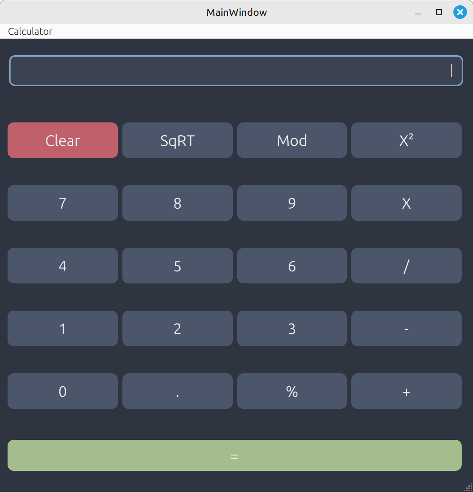

# QT Calculator

A basic calculator built using Qt and C++. Supports addition, subtraction, multiplication, division, and modulo operations. Styled with a dark theme using QSS.

## Screenshot

## Features
- Basic arithmetic operations
- Dark mode UI
- Responsive layout
